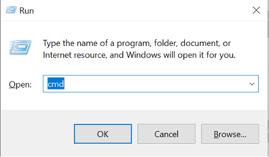

# SFTP instructions for Windows Users

Instructions to copy files to an SFTP server using the command line.

1. Create a folder on your desktop and name the folder as (sitename_date)

   - Example: `chop_20221107`

1. Copy all slide images to this folder.

1. Press `Windows Key + R` on your keyboard, then type `cmd` and press enter.

   

   - Note: You can also right-click on your start menu and click `Command Prompt` on Windows 8 or later.

1. Type in the following command and press the Enter key to upload the folder on your desktop, replacing `<Folder_Name>` with the name of the folder created in Step 1.

   - `cd %UserProfile%\Desktop\<Folder_Name>`
   - Example: `cd %UserProfile%\Desktop\chop_20221107`

1. This will show you the file path to your new folder. Copy it to a notepad and save it for later.

   - It should look something like this: `C:/Users/MyUserName/Desktop/chop_20221107`

1. Copy the command below and replace the prompts below with the credentials you were provided:

   - `sftp <Username>@<Hostname>`
     - Hostname: Enter the hostname provided without `http://` or `https://` (Ex. `sftp.d3b.io`)
     - Username: Enter the provided username.
   - Example: `sftp johndoe@sftp.d3b.io`

1. If you entered the command correctly, you will be prompted for your password. Type this in as it was sent to you. It won't be visible while you're typing it. (Note: This is case-sensitive.)

   - You may be prompted to continue connecting with the message below. If this happens, type `yes` and press Enter.

   

1. If successful, your prompt will change to `sftp>` Type in the following command and press the Enter key to upload the folder on your desktop, replacing `<Folder_Name>` with the name of the folder created in Step 1.

   - `put -r C:/Users/MyUserName/Desktop/<Folder_Name>`
   - Example: `put -r C:/Users/MyUserName/Desktop/chop_20221107`

1. Wait for transfer to complete, then type `exit`
