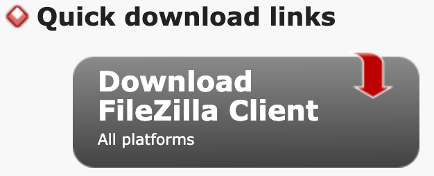
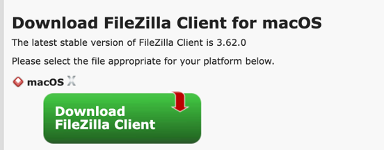
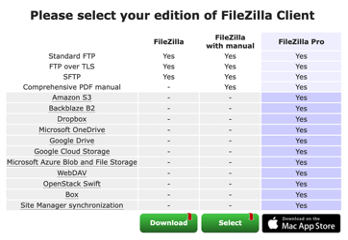
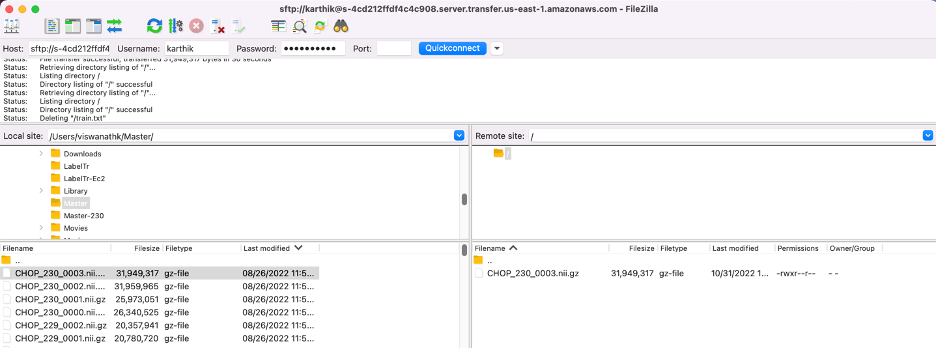

# Connect to SFTP endpoint using FileZilla

Steps to install and operate FileZilla to connect to an SFTP endpoint.

## Instructions

### Install FileZilla

1. Navigate to https://filezilla-project.org/

1. Click on Download FileZilla Client.

   

1. Click on Download File Zilla Client depending on your Operating system: Windows/MacOS:

   

1. Click on Download under Filezilla.

   

1. Go to Downloads and double click on Filezilla and Install the application.

1. FileZilla may ask if you would like to install additional software. Deny/Refuse these as they are not necessary to operate FileZilla.

### Connect to SFTP with FileZilla

1. Enter the provided information into the FileZilla client:

   - Hostname: Enter the hostname provided without `http://` or `https://` (Ex. `sftp.d3b.io`)
   - Username: Enter the provided username.
   - Password: Enter the provided password. (Note: This is case-sensitive.)
   - Port: Leave this blank. (FileZilla will use the default SFTP port, 21)

1. After successful connection you will now be able to transfer files by selecting the files on your left pane and dragging it over to the right pane.

   
